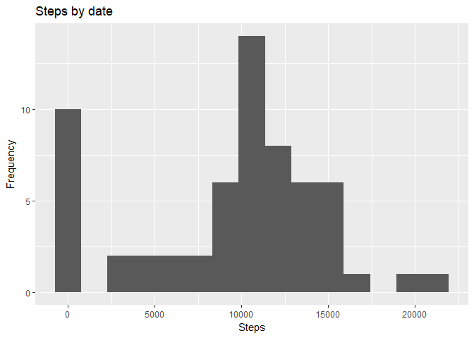

## Loading and preprocessing the data

```r
library(data.table)
# Unzip data if needed
# unzip("activity.zip")

actData <- fread("activity.csv")
actData[, date := as.Date(date)]
```

## What is mean total number of steps taken per day?

```r
# Get total steps per day
actData[, stepsDay := sum(steps, na.rm = T), by=date]

library(ggplot2)

ggplot(actData[, mean(stepsDay), by=date], aes(x = date, y = V1)) +
  geom_bar(stat = "identity") +
  labs(title="Steps by date",x="Date", y="Steps")
```

<!-- -->


## What is the average daily activity pattern?


```r
# Code used to get the data below
# mean(actData[, mean(stepsDay), by=date]$V1)
#median(actData[, mean(stepsDay), by=date]$V1)
```

The mean steps taken each day is **9354.2295082** and the
median steps taken is **1.0395\times 10^{4}**.


#### Average steps taken per day


```r
ggplot(actData[, mean(stepsDay), by=date], aes(x = date, y = V1)) +
  geom_line() +
  labs(title="Average steps taken", x="Date", y="Steps")
```

<!-- -->


```r
# Get mean for each interval and get descending order
orderedIntervals <- actData[, mean(steps, na.rm=T), by=interval][order(-V1),]

# orderedIntervals[1]$interval
# orderedIntervals[1]$V1
```

The interval with the most steps on average is interval **\#835** with **206.1698113** steps. The following graph shows the distribution:


```r
ggplot(orderedIntervals, aes(x = interval, y = V1)) +
  geom_line() +
  labs(title="Average steps taken", x="Interval", y="Steps")
```

<!-- -->

## Imputing missing values

You can impute values by replacing them by the mean of that specific interval across the data.


```r
# Impute values by the mean
actData[, stepsInterval := mean(steps, na.rm=T), by=interval]
actData[is.na(steps), steps := as.integer(stepsInterval)]

# Graph histogram after imputing values
# Get total steps per day
actData[, stepsDay := NULL]
actData[, stepsDay := sum(steps, na.rm = T), by=date]

ggplot(actData, aes(x = date, y = stepsDay)) +
  geom_bar(stat = "identity") +
  labs(title="Steps by date after imputing data",x="Date", y="Steps")
```

<!-- -->

## Are there differences in activity patterns between weekdays and weekends?

Here we plot the difference between activity patterns during weekdays and weekends.


```r
actData[, isWeekend := weekdays(date) == "Sunday" |
                      weekdays(date) == "Saturday"]

avgIntWeek <- actData[, mean(steps), by=.(isWeekend, interval)]
avgIntWeek[, isWeekend := factor(isWeekend)]
levels(avgIntWeek$isWeekend) <- c("Weekday", "Weekend")

ggplot(avgIntWeek, aes(x = interval, y = V1)) +
  geom_line(stat = "identity") +
  facet_grid(. ~ isWeekend) +
  labs(title="Steps by interval after imputing data",x="Interval", y="Steps")
```

<!-- -->

We can see that there's a clear difference between activity levels.
